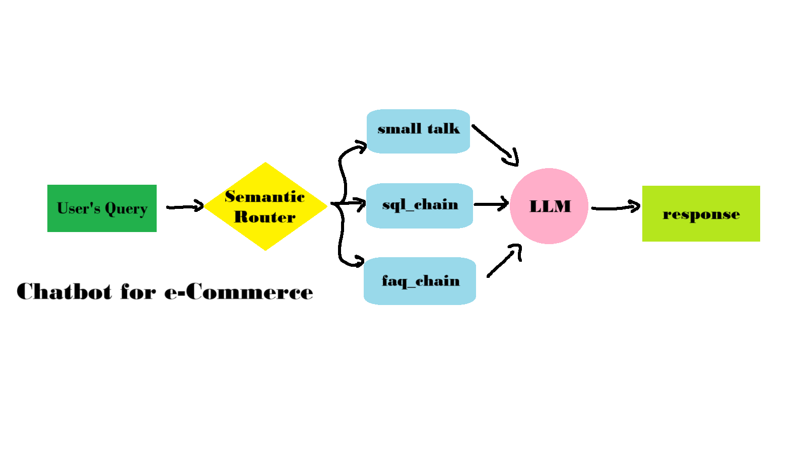

# 🛒 E-commerce Chatbot (Flipkart-based)

This project is an **AI-powered chatbot for e-commerce** that helps users interact with product data, answer FAQs, and engage in small talk.  
It is built on a **scraped Flipkart dataset (1000 products)**, but the same approach can be easily extrapolated to more products or even adapted for **other e-commerce platforms**.  

<p align="center">
  
</p>

---

## ⚡ Features
- **Semantic Router**: Classifies queries into `faq`, `sql`, or `small-talk`.
- **FAQ Retrieval**: Uses **ChromaDB** to fetch answers from stored FAQs.
- **Product Search (SQL)**: Converts natural language queries into SQL queries for a product database.
- **Small Talk**: Handles casual conversation with users.
- **Streamlit UI**: Chat interface to interact with the bot.

---

## 📂 Project Structure

```
├── main.py          # Streamlit app entry point
├── router.py        # Routes queries to faq/sql/small-talk
├── sql.py           # SQL query generation + execution
├── faq.py           # FAQ ingestion + retrieval
├── smalltalk.py     # Small-talk response generation
├── resources/
│   └── faq_data.csv # FAQ dataset
├── db.sqlite        # Product database (scraped Flipkart products)
├── architecture.png # Architecture diagram
└── README.md        # Project documentation
```

---

## 🔑 Tech Stack
- **Python 3.10+**
- **Streamlit** – UI for chatbot
- **ChromaDB** – Vector database for FAQ storage
- **Groq LLM** – Natural language processing
- **Cohere Encoder** – Semantic routing
- **SQLite** – Product database backend
- **Pandas** – Data processing

---

## ⚙️ Setup & Installation

1. **Clone repo**
   ```bash
   git clone https://github.com/your-username/ecommerce-chatbot.git
   cd ecommerce-chatbot
   ```

2. **Create virtual environment**
   ```bash
   python -m venv venv
   source venv/bin/activate  # (Linux/Mac)
   venv\Scripts\activate     # (Windows)
   ```

3. **Install dependencies**
   ```bash
   pip install -r requirements.txt
   ```

4. **Set environment variables**  
   Create a `.env` file with:
   ```env
   GROQ_MODEL=groq/llama-3.1-70b-versatile
   COHERE_API_KEY=your-cohere-api-key
   ```

5. **Run Streamlit app**
   ```bash
   streamlit run main.py
   ```

---

## 📊 Example Queries
- **FAQ**:  
  *“What is the return policy?”*  
- **SQL/Product Search**:  
  *“Show me Nike shoes under Rs. 3000 with discount.”*  
- **Small Talk**:  
  *“Hi, how are you?”*  

---

## 🚀 Future Improvements
- Add support for **order tracking queries**.
- Integrate with **real-time Flipkart APIs**.
- Enhance **multi-turn conversations**.
- Add **authentication layer** for personalized queries.

---

## 📘 Dataset
- The dataset was obtained by **scraping 1000 Flipkart products directly from the website**.  
- The schema includes: product link, title, brand, price, discount, average rating, and total ratings.  
- This approach can be **scaled to larger product catalogs** or **adapted for other e-commerce platforms** (e.g., Amazon, eBay).  

---

## 📷 Screenshot


